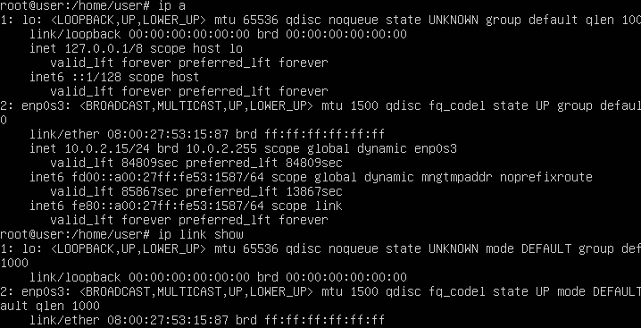
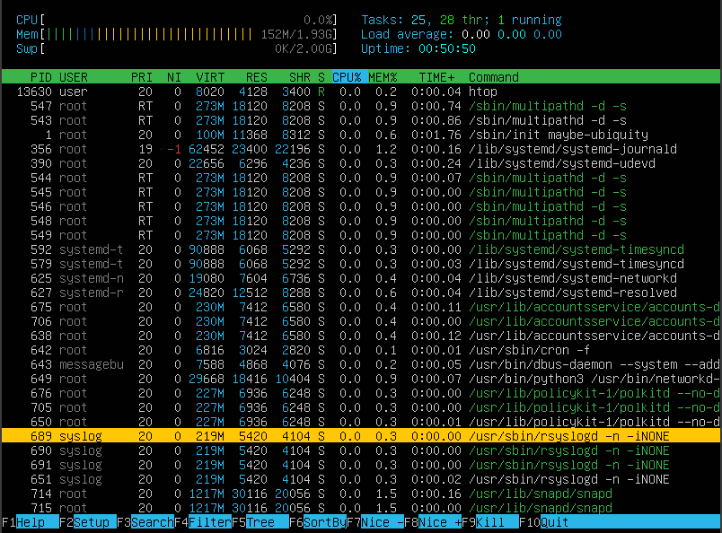
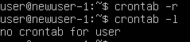

## 1. Установка ОС
* Вывод версии установленной ОС

    

## 2. Создание пользователя
* Добавление нового пользователя (```sudo useradd user_name```)

    

* Добавление пользователя в группу (```sudo usermod -g group_name user_name```)

    

* Информация о пользователях

    

## 3. Настройка сети ОС

* Задание нового hostname делается с помощью изменения имени в директории ```/etc/hostname```

* Установка временной зоны производится с помощью команды ```dpkg-reconfigure tzdata```

    

* Сетевые интерфейсы на устройстве ```ip link show``` или ```ip a```

    

*Сетевой интерфейс lo - loopback interface (петлевой интерфейс). Данный интерфейс используется дл тестирования сетевых приложение и протоколов без необходимости использовать физицескую сеть. Позволяет отправлять и получать пакеты самому себе. Такой интерфейс используется для внутренней коммуникации на устройстве. Адрес **127.0.0.1** для IPv4 также известен как **localhost**. Также данный интерфейс используется для тестирвоания сетевых приложений и протоколов. Такой интерфейс не достуен извне, поэтому он безопасен для использования в тестировании и разработке. Интерфейс lo обычно настроен автоматически и не треубет дополнительных настроек.*

* Адрес используемый устройством *(можно посмотреть в изображении выше)* - ***10.0.2.15***.

*DHCP - Dynamic Host Configuration Protocol - сетевой протокол, который используется для автоматического назначения IP=адреса и других параметров для устройств, которые находятя в сети. Основными функциями данного протоколоа являются:*

- *назначение IP-адреса;*
- *назначение маски подсети;*
- *назначение шлюза по умолчанию;*
- *назначение DNS-сервера.*

*DHCP-сервер - сервер, который управляет пулом IP-адресов идругими сетевыми параметрами. DHCP-клиент - устройство, которое запрашивает IP-адрес и другие сетевые параметры.*

* Определение внутренного IP-адреса шлюза (*10.0.2.2*)

    

* Внешниий IP-адрес (*213.247.189.234*) можно определить с помощью команды ```curl ifconfig.me``` или ```wget -qO- ifconfig.me```.

    

* Изменение настроек сети

* Для того, чтобы поменять настройки сети с динамического получения адреса на статическое(заданное руками) необходимо выполнить измениня в конфигураионном файлу .yaml, который находится в директории ```/etc/netplan/0-net.yaml```. Для того, чтобы проверить корректность работы конфига можно выполнить команду ```sudo netplan try``` позволят предварительно протестировать работу системы.

    

    

    

* Проверка доступности удаленных хостов

    

## 4. Обновление ОС

* Для обновления системных пакетов используем команды ```apt update && apt upgrade```

    

## 5. Использование команды sudo

Sudo это слово сокращение от `superuser do`, что если переводить дословно - суперпользователь сделай. Это команда для выполнения команд с расширенными привелегиями суперпользователя или root. Данная команда позволяет обычным пользователям выполнять задачи администрирования сисетмы без входа в систему от имении root.

Для того, чтобы пользователю дать возможность выполнять команды от суперпользователя, надо выполнить следующее:

1. От пользователя, у которого есть права суперпользователя вводим команду ```sudo visudo```
2. Добавляем в файл следующую строку с привелегиями root ```username ALL=(ALL:ALL) ALL```
3. Скриншот измененного hostname

    

## 6. Установка и настройка службы времени

* 

* 

## 7. Установка и использование текстовых редакторов

* Для того, чтобы создать и редактировать файл в текстовом редакторе vim необходимо выолнить команду ```vim filename```. Изначально vim открывается в обычном режиме, в котором невозможо выполнить вставку текста, для того, чтобы вставить текст, необхдимо нажать клавишу `i`. Для того, чтобы записать изменения необходимо выйти из режима вставки текста с помощью клавиши `esc`. Для того, чтобы сохранить изменения внесенные в файл необходимо в обычном режиме последовательно набрать `:w`(записать изменения) и `:q`(выйти из текстового редактора), или набрать `:wq`, что позволит выйти из текстового редактора после записи изменений.

    

* Для того, чтобы создать и редактировать файл в текстовом редакторе nano необходимо выолнить команду ```nano filename```. В текстовом редакторе nano можно вносить изменения сразу в нем нет различных режимов, как, например, в vim. Для того, чтобы сохранить изменения внесенные в файл необходимо нажать комбинацию клавищ `ctrl^+S`(сохранить изменения) и `ctrl^+X`(выйти из текстового редактора), или нажать `ctrl^+X`, затем согласиться с внесенными изменениями `y` и `enter` для выхода из режима редактирования.

    

* Для того, чтобы создать и редактировать файл в текстовом редакторе mcedit необходимо выолнить команду ```mcedit filename```. В текстовом редакторе mcedit можно вносить изменения сразу в нем нет различных режимов, как, например, в vim. Для того, чтобы сохранить изменения внесенные в файл необходимо нажать комбинацию клавищ `F2`(сохранить изменения) и `F10`(выйти из текстового редактора), или нажать `F10`, затем согласиться с внесенными изменениями `yes` для выхода из режима редактирования.

    

* Для того, чтобы редактировать файл в текстовом редакторе vim необходимо выполнить команду ```vim test_vim.txt```. После того, как откроется файл, на строку, которую мы хотим удалить переводим курсос и нажимаем `dd`, таким образом удаляется вся строка, либо нажимеам клавишу `i` и клавишой `Backspace` или `Delete` удаляем строку. Затем вставляем необходимую строку. Для того, чтобы выйти без сохранения, после редактирвоания нажимаем клавишу `esc` и вводим `:q!`, таким образом изменения не запишутся и файл останется неизмененным.

    

* Для того, чтобы редактировать файл в текстовом редакторе nano необходимо выполнить команду ```nano test_nano.txt```. После того, как откроется файл, на строку, которую мы хотим удалить переводим курсос и нажимаем `ctrl^+K`, таким образом удаляется вся строка, либо клавишой `Backspace` или `Delete` удаляем строку. Затем вставляем необходимую строку. Для того, чтобы выйти без сохранения, после редактирвоания нажимаем клавишу `ctrl^+X` и вводим `n` и `enter`, таким образом изменения не запишутся и файл останется неизмененным.

    

* Для того, чтобы редактировать файл в текстовом редакторе mcedit необходимо выполнить команду ```nano test_mcedit.txt```. После того, как откроется файл, на строку, которую мы хотим удалить переводим курсос и нажимаем `ctrl^+K`, таким образом удаляется вся строка, либо клавишой `Backspace` или `Delete` удаляем строку. Затем вставляем необходимую строку. Для того, чтобы выйти без сохранения, после редактирвоания нажимаем клавишу `F10` и выбираем `no` и `enter`, таким образом изменения не запишутся и файл останется неизмененным.

    

* Для поиска по текстовому редактору vim в режиме команд(обычном режиме) необходимо ввести `/search_word`, затем `enter`. Находит все заданные совпадения, если есть несколько совпадений, можно передвигать курсос с помощью клавиш `n`(для перемещения вниз по тексту) или 'N'(для перемещения вверх по тексту). Для того чтобы выполнить поиск с заменой в строке необходимо в режиме команд ввести `:s/oldword/newword`. Данная команда заменит слово в строкена которой находится курсор, если мы хотим заменить найденные слова в диапазонах строк, то вводим команду `:1,2s/oldword/newword`, или заменить все найденные слова `:%s/oldword/newword/g`. Пример ниже:

    

* Для поиска по текстовому редактору nano необходимо нажать `ctrl^+W`, затем искомое слова и 'enter'. Находит все заданные совпадения, если есть несколько совпадений, можно перемещаться с помощью клавиш `Alt+W`(для перемещения вниз по тексту) или `ctrl^+W`. Для того чтобы выполнить поиск с заменой в строке необходимо нажать комбинацию `ctrl^+\`.Nano предложит написать слово, которое мы хотим найти, затем нажать `enter`, программа предложит написать слово, на которое мы хотим поменять и нажимаем `enter`. Если мы хотим внести изменения только в конкретную строку, то нажимаем `y` `ctrl^+C`, если мы хотим выполнить изменения во всем тексте, то нажимаем `A`. Данная команда заменит слово в строкена которой находится курсор. Пример ниже:

    

* Для поиска по текстовому редактору nano необходимо нажать `F7`, затем искомое слова и 'enter', также можно установтиь дополнительные параметры поиска в появившемся меню. Находит все заданные совпадения. Для того чтобы выполнить поиск с заменой в строке необходимо нажать `F4`.В появившемся меню пишем слово, которое мы хотим найти, и слово на которое мы хотим вставить вместо старого. Также в меню можно выполнеить дополниельные параметры, затем выбираем `yes` и нажимаем `enter`. Если мы хотим внести изменения только в конкретной строку, то выбираем `Replace`, если мы хотим выполнить изменения во всем тексте, то выбираем `All`. Пример ниже:

    

## 8. Установка и базовая настройка сервиса SSHD

* Установка служб ssh выполняется командой ```sudo apt install ssh```.

    

* Добавление в автозапуск службы ssh

    
и проверка, что он добавлен в службу автоматического запуска

    

* Перенастроить порт SSHd на 2022 можно в файлe sshd_config

    

    Далее надо разрешить трафик на указанный нами порт, сделать это можно следующими командами
    
    

* Просмотреть запущенные процессы службы ssh можно с помощью ключа aux, например ```ps aux | grep sshd```. В данной команде `ps` можно используются следующие ключи, которые каждый имеет свое значение:
    * -A, -e, (a) - выводит все процессы;
    * -a - выбирает все процессы, кроме фоновых;
    * -d, (g) - выбирает все процессы, кроме процессов различных сессий;
    * -N - выбирает все процессы кроме указанных;
    * -G - выбирает все процессы по ID группы;
    * -p, (P) - выбирает проуессы PID;
    * --ppid - позволяет выбирать процессы по PID родительского процесса;
    * -s - выбирает процессы по ID сессии;
    * -t, (t) - выбирает процессы по tty;
    * -u, (U) - выбирает процессы пользователя;
    * -x - выбирает процессы, остоединенные от терминала.

    Также применяются различные ключи для форматирования:
    * -с - отображает информацию планировщика;
    * -f - выводит маскимальное количество доступных данных;
    * -F - то же самое, что и -f, только более расширенный список данных;
    * -l - длинный формат вывода;
    * -j, (j) - выводит процессы в рабочем стиле, где минимум информации;
    * -M, (Z) - добавляет информацию о безопасности;
    * -o, (o) - позволяет определить формат вывода;
    * --sort, (k) - выполняет сортировку по указанному столбцу;
    * -L, (H) - обображает потоки процессов в столбцах LWP и NLWP;
    * -m, (m) - выводит потоки после процесса;
    * -V, (V) - выводит информацию о версии;
    * -H - отображает дерево процессов.

    Пример использования `ps` с различными флагами

     | grep sshd")

* Установка net-tools

    

* Выполнение команды netstat

    
Ключ отображают следующее:
    * -t - отображает только TCP-соединения;
    * -a - отображает все соединения, которые слушют порты;
    * -n - отображает числовые адреса и номера портов вместо попытки разрешить их в имена.

    0.0.0.0: Это специальный IP-адрес, который означает "все IP-адреса на локальной машине". Когда мы видим 0.0.0.0 в столбце Local Address, это означает, что сервис прослушивает на всех сетевых интерфейсах машины.

## 9. Установка и использование утилит top, htop

*  Вывод команды `top`:
    * uptime - 3 минуты;
    * количество авторизованных пользователей - 1;
    * среднняя загрузка системы - 0.03, 0.11, 0.06;
    * общее количество процессов - 99;
    * загрузка cpu - 0;
    * загрузка памяти - 140.4;
    * pid процесса занимающего больше всего памяти - 1;
    * pid процесса, занимающего больше всего процессорного времени - 1.

    

* Вывод команды `htop`:
    * ```htop -s PID```
    
        
    * ```htop -s PERCENT_CPU```
    
        
    * ```htop -s PERCENT_MEM```
    
        
    * ```htop -s TIME```
    
        
    * Filter for sshd (`F4 - sshd - ender`)
    
        
    * Search syslog (`F3 - syslog - F3`)
    
        
    * Add more information ('F2')
    
        
    
## 10. Использование утилиты fdisk

* Название диска - /dev/sda
* Размер диска - 39.102 Gib
* Количество секторов - 83886016
* Размер swap - 2 Gi (для того, чтобы посмотреть размер swap бфла использована команда ```free -h```)

    

    

## 11. Использование утилиты df
* Использование df; для корневого раздела (/):
    * размер раздела - 38901088;
    * размер занятого пространства - 5361416;
    * размер свободного пространства - 31531404; 
    * процент использования - 15%.
* В выводе команды df единицей измерения является количество байтов, которое выделено, занято и свободно в том или ином разделе.

    
* Использовани df -Th; для корневого раздела (/):
    * размер раздела - 38G;
    * размер занятого пространства - 5.2G;
    * размер свободного пространства - 31G; 
    * процент использования - 15%.
* Тип файловой системы для корневого радела - ext4.

    

## 12. Использование утилиты du

* Вывод запуска команды `du`

    
* Вывод размера папки `/home`

    
* Вывод размера папки `/var`

    
* Вывод размера папки `/var/log`

    
* Вывод размера всего содержимого папки `/var/log/*` в байтах

    
* Вывод размера всего содержимого папки `/var/log/*` в человеческом виде

    

## 13. Установка и использование утилиты ncdu

* Установка `ncdu`

    
* Вывод размера папки `/home`

    
* Вывод размера папки `/var`

    
* Вывод размера папки `/var/log`

    
* Использованные команды

    

## 14. Работа с ситсемными журналами
Для того, чтобы открть системные журнала для просмотра логов можно воспользоваться как ранее изученными текстовыми редакторами, так и встроенными функциями которые есть в системе - `cat`,`tail`,`less` и другие. Вданном задании для вывода системных журналов испольовалась команда `less`.
* /var/log/dmesg

    
* /var/log/syslog

    
* /var/log/auth.log

    
* Время последней успешной авторизации - 27 декабря 2024 года в 9:23:37
* Перезапуск службы SSHd

    
* Логи перезапуска службы SSHd

    

## 15. Использование планировщика заданий CRON

Для того, чтобы добавить команду `uptime` через каждые 2 минуты в планировщик задач необходимо выполнить команду ```crontab -e```. В конце открывшегося файла необходимо добавить строчку **`*/2 * * * * /usr/bin/uptime`**.
* Вывод строк с выполнением `uptime`

    
* Вывод списка задач в планировщике задач

    
* Для того, чтобы удалить все задания из планировщика, необходимо выполнить команду `crontab -r`. Вывод списка задач:

    