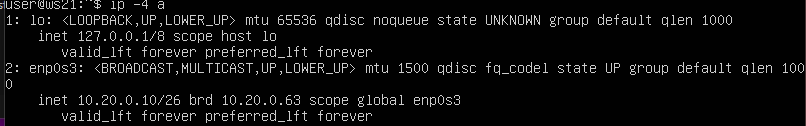
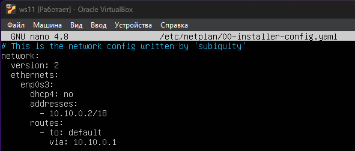
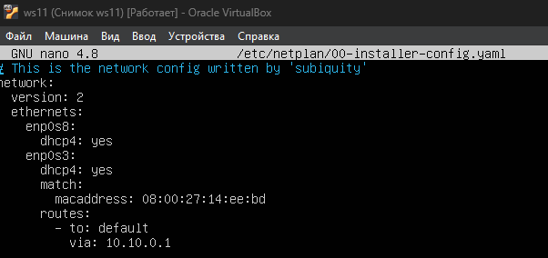
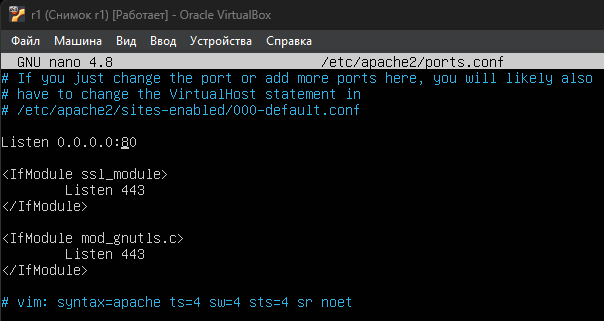

## 1. Инструмент ipcalc

1. Сети и маски

* Адрес сети 192.160.0.0/13

    

* Перевод маски:
    * 255.255.255.0 в двоичной 11111111.11111111.11111111.00000000, в префиксной /24;
    * /15 в обычной 255.254.0.0, в двоичной 11111111.11111110.00000000.00000000;
    * 11111111.11111111.11111111.11110000 в обычной 255.255.255.240, в префиксной /28 (пересчет в обычную и префиксную запись сделан вручную).

        

* Минималный и максимальный хост сети 12.167.38.4 при масках:
    *  /8, минимальный хост - `12.0.0.1`; максимальный хост -`12.255.255.254`;

        
    *  11111111.11111111.00000000.00000000,  минимальный хост - `12.167.0.1`; максимальный хост -`12.167.255.254`;

        
    *  255.255.254.0,  минимальный хост - `12.167.38.1`; максимальный хост -`12.167.39.254`;

        
    * /4, минимальный хост - `0.0.0.1`; максимальный хост -`15.255.255.254`.

        

2. localhost

* 194.34.23.100 - это публичный IP-адрес, из localhost доступ невозможен, т.к. данный адрес не принадлежит диапазону localhost;

* 127.0.0.2 - это локальный IP-адрес диапазона localhost, поэтому доступ возможен и он принадлежит диапазону 127.0.0.0/8, который зарезервирован для localhost;

* 127.1.0.1 - это локальный IP-адрес диапазона localhost, оэтому доступ возможен и он принадлежит диапазону 127.0.0.0/8, который зарезервирован для localhost;

* 128.0.0.1 - это публичный IP-адрес, из localhost доступ невозможен, т.к. данный адрес не принадлежит диапазону localhost.

    

3. Диапазоны и сегменты сетей

* Диапазоны частных IP-адресов:
    - 10.0.0.0 - 10.255.255.255 (Класс A);
    - 172.16.0.0 - 172.31.255.255 (Класс B);
    - 192.168.0.0 - 192.168.255.255 (Класс C).

    Для определения является ли адрес для частной или для публичной сети можно использовать функцию `ipcalc` она также показывает ялвяется ли сеть частной и к какому классу относится (`Class A(B,C), Private Internet`), или же воспользоваться таблицей диапазона часьных IP-адресов, что в данной работе и проделано.
    ```
    - 0.0.0.45 - частный IP-адрес (Класс А);

    - 134.43.0.2 - публичный IP-адрес;

    - 192.168.4.2 - частный IP-адрес (Класс С);

    - 172.20.250.4 - частный IP-адрес (Класс В);

    - 172.0.2.1 - публичный IP-адрес;

    - 192.172.0.1 - публичный IP-адрес;

    - 172.68.0.2 - публичный IP-адрес;

    - 172.16.255.255 - частный IP-адрес (Класс В);

    - 10.10.10.10 - частный IP-адрес (Класс А);

    - 192.169.168.1 - публичный IP-адрес.
    ```

* Для того, чтобы определить возможно ли использовать перечисленные адреса в качестве шлюза необходимо узнать минимальный и максимальный адрес хоста для указанной сети:

    

    Из вывода команды можно сделать заключение, что адреса `10.0.0.1, 10.10.100.1` - не могут быть адресами шлюзов. Адреса `10.10.0.2, 10.10.10.10, 10.10.1.255` - могут быть адресами шлюза.

## 2. Статическая маршрутизация между двумя машинами

* Для того, чтобы поднять 2 виртуальные машины было выполнено клонирование ws1 и переименовывание hostname.
Чтобы посмотреть существующие интерфейсы на ws1 и ws2 выполнена команда `ip a` или `ifconfig`.

    
    

* Сетевой интерфейс внутренней сети на обеих машинах имеет следующие параметры:
    - имя интерфейса - enp0s3$
    - IP-адрес - 10.2.0.15;
    - маску подсети - /24 или 255.255.255.0;
    - шлюз по умолчанию - 10.0.2.255;
    - MAC-адреса;
    - MTU (Maximum Transmission Unit);
    - статус интерфейса и другие параметры.

* Изменение файла `/ets/netplan/*.yaml` можно выполнить с помощью команды ```sudo nano /etc/netplan/00-installer-config.yaml```. В данном файле убираем строчку `dhcp` и добавляем строчку `address` с указанием необходимого адреса и маски.

    
    

* Выполнение команды `netplan apply`

    

1. Добавление статического маршрута вручную

* Для добавленя статического маршрута вручную после настройки сети в VirtualBox, на ws1 вводим команду - ```sudo ip r add 172.16.0.0/12 dev enp0s3```, на ws2 вводим команду - ```sudo ip r add 192.168.0.0/16 dev enp0s3```. После этого проверяем что есть доступность 1-ой и 2-ойй машины с помощью команды `ping` и адреса хоста.

    

    

2. Добавление статического маршрута с сохранением

* Для того, чтобы перезапустить машины на каждой из них вводим команду ```sudo reboot```.

* Для добавления статического маршрута от одной машины к другой вводим ```sudo nano /etc/netplan/*.yaml```. И в данной плане добавляем снизу следующие строки (`routes: - to: 172.16.0.0/12` для ws1, `routes: - to: 192.168.0.0/16` для ws2). Записываем изменения, выходим и вводим команду ```sudo netplan apply```.

    

    После того как применяем изменения в планах проверяем маршрут между машинами с помощью команды `ping адрес хоста`.

    

## 3. Утилита iperf3

* Перевод скорости соединения из одних величин в другие:

    * 8 Mbps = 1 MB/s
    * 100 MB/s = 819 200 Kbps
    * 1 Gbps = 1024 Mbps.

* Для выполнения данного задания была устнаовлена утилита iperf3 - `sudo apt install iperf3`.

    Виртуальная машина ws2 использовалась в качестве сервера, а виртуальная машина ws1 в качестве клиета.

    Замеренные скорости соединенияи, вызов и вывод команд:

    

    

    Также выполнено удаленное подключение с ws2 к ws1, и проведен замер скорости, на клиенту ws2:

    

## 4. Сетевой экран

1. Утилита iptables

* Создание правил на виртуальных машинах ws1 и ws2:

    

    


* Запуск файлов на обеих машинах командами ```chmod +x /etc/firewall.sh```(разрешение на выполнение файла скрипта) и ```/etc/firewall.sh```(выполнение файла скрипта).

    

* Существенной разницей является то, что ws1 не ответит на `ping`, так как запрещающее правило находится выше разрешающего и имеет более высокий приоритет. ws2 в отличии от ws1 ответит на `ping`, так как разрешающее правило находится выше запрещающего и имеет более высокий приоритет.

2. Утилита nmap

* Утилита nmap, с ws2 не пингуется ws1, с помощью утилиты nmap видим, что состояние хоста - Host is up.

    

## 5. Статическая маршрутизация сети

1. НАстройка адресов машин

* Настройка адресов машин проводилась в файле ```etc/netplan/00-installer-config.yaml``` согласно сети указанной на рисунке.

    

    

    

    

    

* Вывод команды `ip -4 a`  и проверка заданных адресов.

    

    

    

    

    

* Пинг ws22 с ws21.

    

* Пинг r1 с ws11.
    

2. Включение переадресации IP-адресов

* Включения переадресации IP с помощью команды ```sysctl -w net.ipv4.ip_forward=1```

    

    При таком подходе переадресация не будет работать после перезагрузки системы.

    Включение переадресации IP путем изменения конфигурационного файла ```/etc/sysctl.conf```

    

3. Установка маршрута по умолчанию

* Настройка маршрута по умолчанию (шлюз) для рабочих станций. Для этого добавили default перед IP-роутера в файле конфигураций.

    

    

    

* Вызов ip r и демонстрация маршрута в таблице маршрутизации.

    

    

* Пропингован роутер r2 с ws11, также на r2выполнена команда ```tcpdump -tn -i enp0s8```

    Для того, чтобы была возможность пропинговать с виртуальной машины ws11 роутер r2, необходимо добавить статическую маршрутизацию на r1 и r2. Для этого, настроили маршрут на роутере r1 путем прописывания шлюза вручную с помощью команды ```sudo ip r add 10.20.0.0/26 via 10.100.0.12 dev enp0s8```, данная команда прописывает шлюз через который роутер r1 может пересылать пакеты на сетевые устройства роутера r2, в частности до сети 10.20.0.0/26. После этого также добавлена связь с сетью 10.10.0.0/18 на роутере r2 ```sudo ip r add 10.10.0.0/18 via 10.100.0.11 dev enp0s8```. Чтобы не делать этого вручную в netplan можно изначально прописать шлюзы или `routes`.

    

4. Добавление статических маршрутов

* Добавление статического маршрута в роутер r1

    

* Добавление статического маршрута в роутер r2

    

* Вызов `ip r` и демонстрация таблицы с маршрутами на роутере r1

    

* Вызов `ip r` и демонстрация таблицы с маршрутами на роутере r2

    

* Запустr команд на ws11: ```ip r list 10.10.0.0/18``` и ```ip r list 0.0.0.0/0```

    

    Команда ip r list 10.10.0.0/18 запрашивает маршрут для сети 10.10.0.0/18. Вывод показывает, что для этой сети используется интерфейс enp0s3 с исходным IP-адресом 10.10.0.2. Этот маршрут является локальным (scope link), что означает, что он относится к сети, к которой непосредственно подключен интерфейс.

    Команда ip r list 0.0.0.0/0 запрашивает маршрут по умолчанию (default route). Вывод показывает, что для маршрута по умолчанию используется шлюз 10.10.0.1 через интерфейс enp0s3. Этот маршрут используется для всех пакетов, которые не соответствуют более специфичным маршрутам.

     Маршруты в таблице маршрутизации имеют разную специфичность. Более специфичные маршруты (с более длинной маской подсети) имеют приоритет над менее специфичными. В данном случае, маршрут 10.10.0.0/18 более специфичен, чем маршрут по умолчанию 0.0.0.0/0. В первом вызове запрашивается маршрут для конкретной сети 10.10.0.0/18, тогда как во втором вызове запрашивается маршрут по умолчанию, который используется для всех остальных адресов.


5. Построение списка маршрутизаторов

* Вывод команды `traceroute`

    

* Вывод части перехваченных пактов с помощью `tcpdump`

    

    **`traceroute`** отправляет серию пакетов с увеличивающимся значением TTL (Time To Live). TTL — это поле в заголовке IP-пакета, которое указывает максимальное количество маршрутизаторов (хопов), через которые пакет может пройти. Начальное значение TTL равно 1. Каждый маршрутизатор, через который проходит пакет, уменьшает значение TTL на 1. Когда TTL достигает нуля, маршрутизатор отбрасывает пакет и отправляет обратно ICMP-сообщение "Time Exceeded" (ICMP тип 11). traceroute использует эти ICMP-сообщения для определения IP-адресов маршрутизаторов на пути. Каждый раз, когда TTL увеличивается, пакет проходит на один хоп дальше, и traceroute получает IP-адрес следующего маршрутизатора. Процесс продолжается до тех пор, пока пакет не достигнет конечного назначения, и traceroute получит ICMP-сообщение "Echo Reply" (ICMP тип 0) или другое сообщение, указывающее на достижение цели.

    Также сообщения ICMP port unreachable указывают на то, что конечный узел достижим, но заданный UDP-порт на этом узле недоступен. Это означает, что сам узел доступен, но конкретный порт (34434), к которому обращается traceroute, не открыт.

6. Использование протокола ICMP при маршрутизации

* Запуск и вывод на r1 перехвата сетевого трафика, проходящего через `enp0s3` с помощью команды ```tcpdump -n -i enp0s3 icmp```

    

* Пинг несуществующего адреса (10.30.0.111) с указанным количеством пакетов (1)

    

## 6. Динамическая настройка IP с помощью DHCP

* Настройка dhcp-сервера на роутере r2 ```/etc/dhcp/dhcpd.conf```

    

    Также для того, чтобы на определенном интерфейсе была возможность раздавать адреса необходимо внести изменения в файл ```/etc/default/isc-dhcp-server```

    

* Изменения в файле ```/etc/resolv.conf```

    

* Перезагрузка службы DHCP командой ```systemctl restart isc-dhcp-server```

    
    
* Изменения в netplan на ws21 - ```dhcp4: yes```

* Проверка получения адреса послу ``reboot``

    

* Проверка досутпности машины ws22 с ws21

    

* Изменение netplan на виртуальной машине ws11

    

* Настройка dhcp-сервера на роутере r1 ```/etc/dhcp/dhcpd.conf```

    

    

* Получение IP адреса после перезагрущки виртуальной машиной ws11

    

* Пинг машины ws22 с ws11

    

* Запрос обновления IP-адреса с ws21

    

    Для того, чтобы запросить новый адрес необходимо выполнить команду ```dhcplient```, таким образом можно получить дополнительный адрес для интерфейса, который может получать адреса по dhcp. Для того, чтобы удалить все адреса полученные от dhcp-сервера, необходимо выполнить команду ```dhcplient -r```.

## 7. NAT

- Ну и в конце в качестве вишенки на торте я расскажу тебе про механизм преобразования адресов.
== Задание ==
В данном задании используются виртуальные машины из Части 5.

* Изменения в файле ```/etc/apache2/ports.conf``` на ws22 cтроки `Listen 80` на `Listen 0.0.0.0:80 `

    

* Изменения в файле ```/etc/apache2/ports.conf``` на r1 cтроки `Listen 80` на `Listen 0.0.0.0:80 `

    

* Запустк веб-сервера Apache командой ```service apache2 start``` на ws22 и r1

    

    

* Добавление правил в фаервол на отбрасывание всех маршрутизируемых пакетов

    

* Проверка соединения между ws22 и r1 командой `ping`

    

* Добавление в файл правила разрешающего маршрутизацию всех пакетов протокола ICMP

    

* Проверка соединения между ws22 и r1 командой `ping`

    

* Включение в правило SNAT и DNAT

    

* Подключение с ws22 к серверу Apache на r1 командой ```telnet 10.10.0.1 80```

    

* Подключение с r1 к серверу Apache на ws22 командой ```telnet 10.20.0.1 80```

    

## 8. Дополнительно. Знакомство с SSH Tunnels

* Запуск на r2 фаервола с правилами из Части 7

    

* Запуск веб-сервера Apache на ws22 только на localhost

    

* Local TCP forwarding с ws21 до ws22

    

* Remote TCP forwarding c ws11 до ws22

    

* Проверка доступа сервера на ws21

    

* Проверка доступа сервера на ws11

    